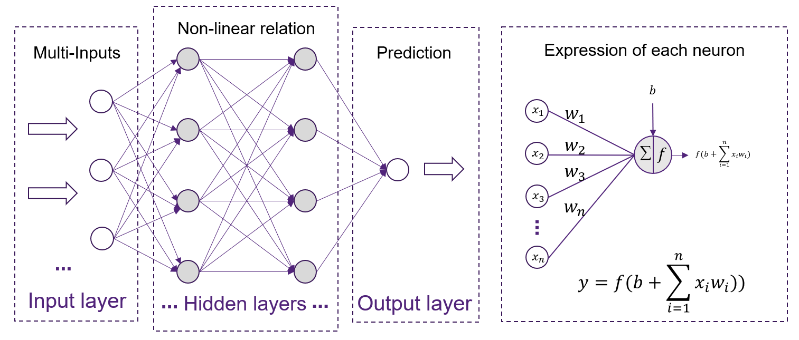

## Neural Network - Introduction
Neural Network is a significant technique in AI, it drives the development of Deep Learning techniques. It is the base of those advanced Deep Learning models, such as CNN, RNN, GAN etc. The Neural Network is very flexible, as it has many usage and can be applied to a lot of cases, such as time-series forecasting problem, image classification, Language processing etc. It is powerful and adaptive to different needs.

## Structure of Neural Network

 
This is a typical structure of Neural Network. The model basically has 3 layers, input layer, hidden layer and output layer. The inputs are passed to the input layer, which is connected to the neurons inside the hidden layer. Each of the neurons will perform the expression shown in the image. The output of the neurons will be the sum of previous input, multiplied by the corresponding weight and added by the bias, and perform the **activation function**. After the inter-connected layer by layer of neurons inside the hidden layer, the complex expression of the data will be expressed by each of the unique weight and bias inside the neurons.
