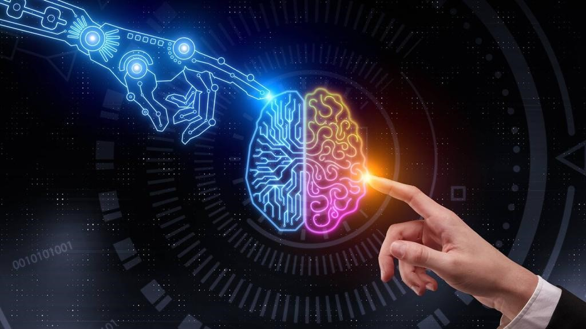

Hello, welcome to my Blog for ELEC4630. I'm Taolue Shen, a 4th year student doing Electrical Engineering at UQ. I'm a passionate student dedicated to studying diverse areas in Engineering.
 
Here is my linkedin page: [link to linkedin](https://www.linkedin.com/in/taolue-shen-77336824b/) 
And my staff page at UQ [link to Staff page](https://itee.uq.edu.au/profile/8751/taolue-shen) 
Welcome to talk with me about all topics in Engineering!
 
## Fastai course
The fastai course by Jeremy Howard is an invaluable course, this course is hugely beneficial for a beginner in AI like me.  
Please follow this link: [link to fast.ai](https://www.fast.ai) to access the fastai course.
 

 
## About the Blog
This Blog will talk about my learning reflections about the fastai course by Jeremy Howard, my understanding of Deep learning technology used in image processing, time-series forecasting, Natural Language Processing etc., let's start the journey of Deep Learning! 

 

